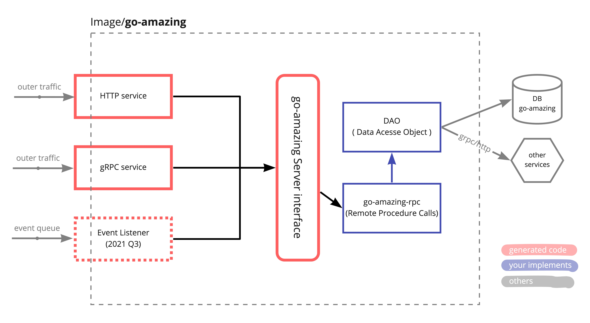
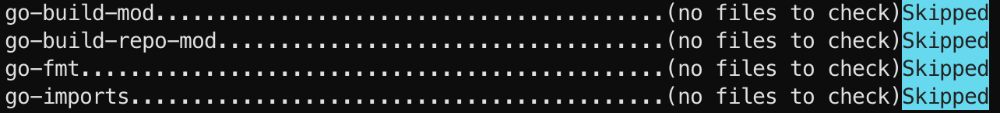

# go-amazing

Go-Amazing is a Golang service template for Amazing Talker. The template bases on [Google/Protobuf](https://developers.google.com/protocol-buffers), it combine our custom generator [AmazingTalker/protoc-gen-svc](https://github.com/AmazingTalker/protoc-gen-svc/) and decoupled Golang utilities [AmazingTalker/go-rpc-kit](https://github.com/AmazingTalker/go-rpc-kit).



## Project Layout

Reference [golang-standards/project-layout](https://github.com/golang-standards/project-layout)

```text
.
├── .github/
│   ├── workflows/
│   │    ├── bake_dev_images_process.yml           # staging-* branches deploy workflow
│   │    ├── bake_release_images_process.yml       # staging branch deploy workflow
│   │    └── run_pr_scout.yml                      # PR description checker
│   └── pull_request_template.md                   # PR description template
├── cmd/                                           # all server start from here
├── internal/
│   └── pkg/
│         └── dao/
│               └── *.go                           # mocks generated by `mockery`
├── migrations/                                    # DB migration files
├── pkg/
│   ├── dao/                                       # Data Access Object
│   ├── rpc/                                       # Remote Process Calls
│   │    └── *.go                                  # <<< Here to write your business logic
│   └── pb/                                        # Protobuf and generated files
│        ├── rpc.proto                             # <<< core protobuf file ( get start from here)
│        └── *.go                                  # xxx DO NOT EDIT generated files  xxx
├── docker-compose.yml
├── Dockerfile
├── go.mod
├── go.sum
├── Makefile
└── dockerbuild.sh                                 # most of command entry point
```

## Workflows

- [bake_dev_images_process.yml](./.github/workflows/bake_dev_images_process.yml)

  - It'll be triggered when `staging-*` branches(tt, st, rt ,cs) pushed.
  - Test, build, and push image to AWS ECR, update the helm chart value to update the `staging-*` image on ArgoCD

- [bake_release_images_process.yml](./.github/workflows/bake_release_images_process.yml)

  - It'll be triggered when `main` branch pushed.
  - Will add a release tag.
  - Test, build, and push image to AWS ECR, update the helm chart value to update the `staging` image on ArgoCD

- [run_pr_scout.yml](./.github/workflows/run_pr_scout.yml)

  - Check the PR description has the required information

## Discussions, History and RoadMap

Records

- [Asana/andrewchen-infra-011 - Service template language usage selection](https://app.asana.com/0/0/1200188075396591/f)
- [Asana/andrewchen-infra-018 - Retrofit Team Dev Service template building ticket](https://app.asana.com/0/1200305094132197/1199167442556977/f)
- (WIP) Asana/andrewchen-infra-xxx - Why we need service template
- (WIP) Asana/andrewchen-infra-xxx - Developing history

RoadMap

- [Notion/Service Template phase 1](https://www.notion.so/amazingtalker/Service-Template-phase-1-268ba079fd4344babe77d5d3d4b272e1)

## CI/CD flowchart

Base on Github Actions and ArgoCD

Please reference to the [documentation](https://www.notion.so/amazingtalker/How-to-deploy-a-new-service-d09a4f91913d4fba80a0c467cb7d5ab1)

## Requirements or Base Knowledge

Make sure you installed (or allow to use) all following scripts or compilers:

- [Golang ~1.16](https://golang.org/)
- [Docker](https://www.docker.com/), [Docker Compose](https://docs.docker.com/compose/cli-command/)
- [Makefile](https://en.wikipedia.org/wiki/Make_(software))
- [Protobuf/protoc](http://google.github.io/proto-lens/installing-protoc.html)
- [Pre-Commit](https://pre-commit.com)
- [mockery >= 2.12](https://github.com/vektra/mockery)

If you do not want to install scripts or compilers on your device, we provided all docker-based generating and testing processes. You could implement a new service simply with the Docker environment.

## Get Started

### Setup `mockery`

`mockery` provides the ability to easily generate mocks for golang interface before running unit tests. Recommand to install it manually before launching this project ([Reference](https://github.com/vektra/mockery#installation)).
- Using homebrew: `brew install mockery`
- Using Github Release: download binary from [release page](https://github.com/vektra/mockery/releases)
- Using go install: `go install github.com/vektra/mockery/v2@latest` (Deprecated soon)

### Run the demo services

It is recommanded to run the demo services if you use the go-amazing template at the first time.

See [this guide](https://www.notion.so/amazingtalker/Start-the-Demo-Services-07377f0d2f0942acae5cbea70a617e52) to start the demo services.

### Implement Your New Service

- [Start the Demo Services](https://www.notion.so/amazingtalker/Start-the-Demo-Services-07377f0d2f0942acae5cbea70a617e52)
- [How to Implement Your Own Service and test case](https://www.notion.so/amazingtalker/How-to-Implement-Your-Own-Service-and-testcase-1943693c21874598ae2a2e13a4fe4ac1)

### Setup Pre-Commit (Git Hooks)

- Before the first commit, you need to have the [pre-commit](https://pre-commit.com/) package manager installed.
  - Using pip: `pip3 install pre-commit`
  - Using homebrew: `brew install pre-commit`
- Install the git hook scripts on `$GO_AMAZING_REPO_ROOT`

  ``` bash
  $ pre-commit install
  pre-commit installed at .git/hooks/pre-commit
  ```

- (optional) Test it: `pre-commit run`
  

## Dependencies

Service Base

- See go modules file [go.mod](./go.mod)

Protoc

- [AmazingTalker/protoc-gen-svc](https://github.com/AmazingTalker/protoc-gen-svc/)
- [AmazingTalker/protoc-gen-svc](github.com/AmazingTalker/protoc-gen-svc)
- [andrewchen20/protoc_golang](https://hub.docker.com/repository/docker/andrewchen20/protoc_golang).
- [protoc-gen-go](google.golang.org/protobuf/cmd/protoc-gen-go)
- [protoc-gen-go-grpc](google.golang.org/grpc/cmd/protoc-gen-go-grpc)
- [protoc-gen-gofast](github.com/gogo/protobuf/protoc-gen-gofast)
- [protoc-gen-gogo](github.com/gogo/protobuf/protoc-gen-gogo)
